<div align="center">

   


<br/>

<a href="#"></a>
<a href="#"></a>
<a href="#"></a>

</div>

<br/>

##  About Me

I'm a **BS Cybersecurity student at UET Lahore**, coming from a **non-technical background** and building my way — from first line of Python to offensive security — one project at a time.

This repository is my **public learning log**: real projects, real mistakes, real progress. Nothing here is staged to look perfect. It's staged to show growth.

<div align="center">

```text
Non-Tech Background
        │
        ▼
   Learn the Basics  (Python)
        │
        ▼
     Build Projects
        │
        ▼
   Break Things       (Labs, CTFs, HTB/THM)
        │
        ▼
   Understand Why
        │
        ▼
     Improve
        │
        ▼
   Build Something Better
```

</div>

>  *AI helps me move faster. Understanding helps me move forward.*

<br/>

##  Tech Stack & Tools

<div align="center">


<br/><br/>


</div>

<br/>

<div align="center">

|  Category |  Tools |
|:---|:---|
| **Languages** | Python (strongest), Bash |
| **Environment** | Kali Linux, Linux CLI |
| **Web / AppSec** | Burp Suite |
| **Practice Labs** | Hack The Box, TryHackMe |
| **Dev Tools** | VS Code, Git & GitHub |
| **AI** | LLMs, RAG, AI-assisted development |

</div>

<br/>

##  Featured Projects

> Projects I'm actively building or proud of. Updated as I go.

<div align="center">

<table>
<tr>
<td width="50%" valign="top">

###  ThreatLens
An OSINT threat-intel dashboard pulling live IOCs from ThreatFox (abuse.ch) with search, filtering, and visualizations.

`Python` `Streamlit` `Pandas` `Plotly`

</td>
<td width="50%" valign="top">

###  Coming Soon
More projects being built...

`Python`

</td>
</tr>
<tr>
<td width="50%" valign="top">

###  Coming Soon
AI experiments & applications

`AI`

</td>
<td width="50%" valign="top">

###  Coming Soon
Offensive security / CTF write-ups

`Security`

</td>
</tr>
</table>

</div>

<br/>

##  Project Categories

<table>
<tr>
<td width="33%" valign="top" align="center">

###  Python
Programs, automation scripts, and tools built while strengthening core programming fundamentals.

</td>
<td width="33%" valign="top" align="center">

###  AI
Projects involving LLMs, RAG pipelines, AI-assisted apps, and experimentation.

</td>
<td width="33%" valign="top" align="center">

###  Cybersecurity
Labs, write-ups, and tooling built while learning offensive & defensive security — from HTB/THM boxes to custom scripts.

</td>
</tr>
</table>

<br/>

##  Current Progress

```text
Python           ████████░░  80%
Cybersecurity     ███░░░░░░░  30%
AI / LLMs         ███░░░░░░░  30%
Offensive Sec     ██░░░░░░░░  20%
Projects Shipped  ███░░░░░░░  30%
```

> These bars aren't a certification — they're a mirror. Updated honestly, not for show.

<br/>

##  Roadmap

<table>
<tr>
<td valign="top" width="50%">

** Done**
- [x] Start BS Cybersecurity @ UET Lahore
- [x] Learn Python fundamentals
- [x] Start building real projects
- [x] Get hands-on with Kali Linux & CLI
- [x] Start solving HTB / THM machines
- [x] Explore Burp Suite for web app testing

</td>
<td valign="top" width="50%">

** In Progress / Next**
- [ ] Build more substantial Python projects
- [ ] Go deeper on networking fundamentals
- [ ] Strengthen Linux internals knowledge
- [ ] Build more AI-powered applications
- [ ] Document CTF/lab write-ups properly
- [ ] Start contributing to open-source security tools

</td>
</tr>
</table>

<div align="center">

```text
Python  →  CS Fundamentals  →  Networking + Linux Internals
   →  AI + Automation  →  Offensive Security (HTB / THM)
   →  Web App Security (Burp Suite)  →  Real-World Security Projects
```

</div>

<br/>

##  AI-Assisted Learning

AI is part of how I learn — not a replacement for learning.

I use it to:
-  Understand unfamiliar concepts, fast
-  Debug and troubleshoot broken code
-  Compare different approaches before committing to one
-  Brainstorm project ideas
-  Get unstuck without losing the thread of *why* something works

> The goal isn't to generate code. The goal is to understand it.

<br/>

##  GitHub Stats

<div align="center">


<br/>


<br/><br/>


</div>

<br/>

##  Why `scriptkiddiee0`?

The name's a little self-aware on purpose.

There's a real difference between running someone else's tool and understanding what that tool is actually doing under the hood. I know I'm early in that journey — so instead of hiding the "beginner" label, I'm wearing it while I close the gap.

**Everyone starts somewhere. This is where I started — and where I keep going.**

<br/>

<div align="center">

###  Follow the journey

Interested in cybersecurity, Python, or watching someone build skills from zero? You're welcome here.

**This repository grows as I grow.**

*Still learning. Still building. Still breaking things — on purpose, this time.*

If something here is useful, a star helps more than you'd think. 

<br/>

```
[ EOF ] — connection closed by scriptkiddiee0 
```

</div>
